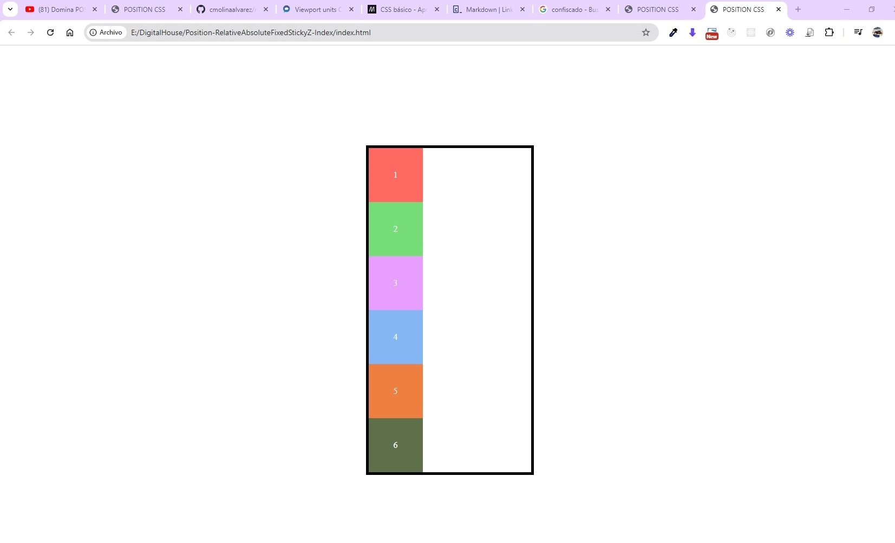
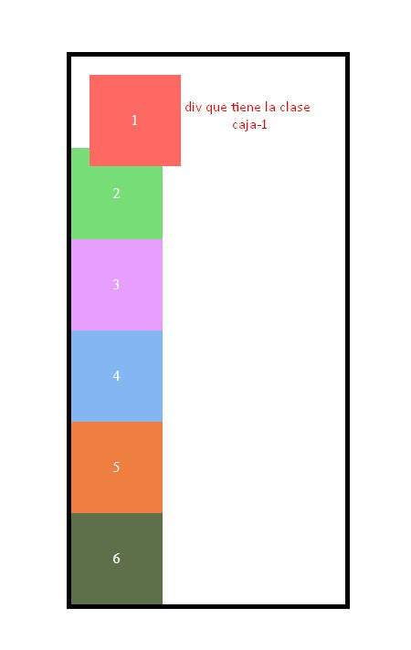
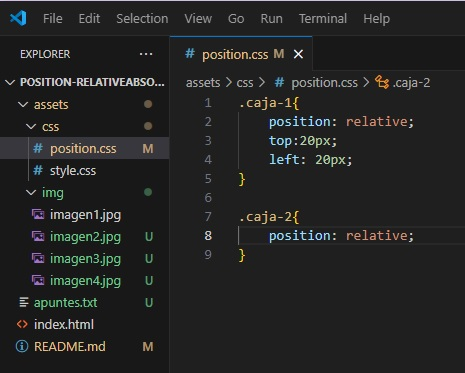
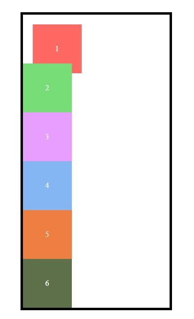
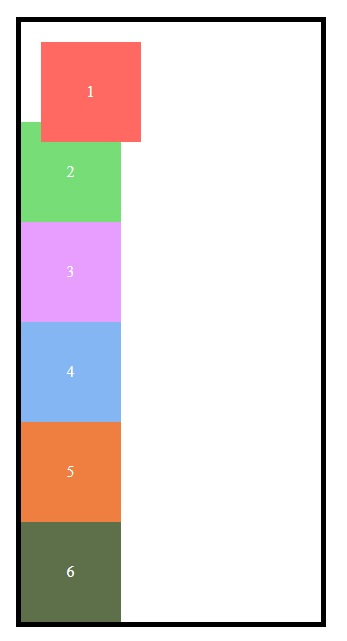
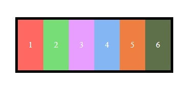
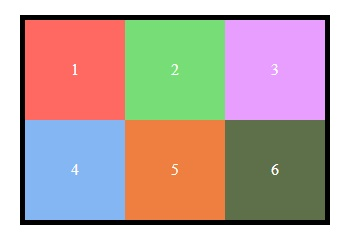
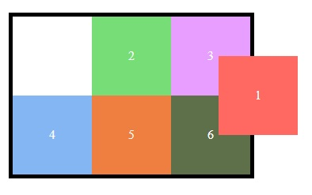
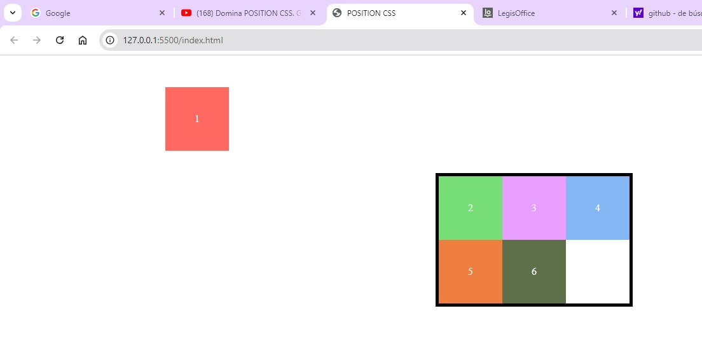
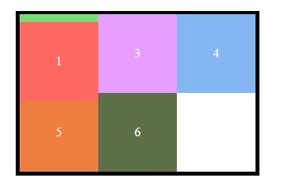

# POSITION

1. La página inicial

    1. 
    
    ```html
    <!DOCTYPE html>
    <html lang="en">
    <head>
        <meta charset="UTF-8">
        <meta name="viewport" content="width=device-width, initial-scale=1.0">
        <link rel="stylesheet" href="assets/css/style.css">
        <link rel="stylesheet" href="assets/css/position.css">
        <title>POSITION CSS</title>
    </head>
    <body>

        <div class="contenedor">
            <div class="caja caja-1">1</div>
            <div class="caja caja-2">2</div>
            <div class="caja caja-3">3</div>
            <div class="caja caja-4">4</div>
            <div class="caja caja-5">5</div>
            <div class="caja caja-6">6</div>        
        </div>
    </body>
    </html>
    ```
    2. El html anterior nos muestra que tenemos un contenedor div y 6 cajas, cada una con 2 clases, una clase general llamada caja y otra clase invidual para cada una, llamadas caja-1, caja-2, caja-3, caja-4, caja-5 y caja-6.

2. El estilo CSS para el archivo style.css

    1. 

    ```CSS
    html, body{
        margin:0;
        padding:0;
        box-sizing: border-box;
    }

    .contenedor{
        margin:20vh auto;  
        border:5px solid black;     
        width: 300px; 
    }

    .caja{
        width:100px;
        height: 100px;
        text-align: center;
        color:white;
    }

    .caja-1{
        background-color: #FF6961;
    }

    .caja-2{
        background-color: #77dd77;
    }
    .caja-3{
        background-color: #E79EFF;
    }
    .caja-4{
        background-color: #84B6F4;
    }
    .caja-5{
        background-color: #EE7F41;
    }
    .caja-6{
        background-color: #5E704A;
    }
    ```

    2. El estilo configura en las etiquetas HTML y BODY margen:0, padding:0 y la configuración de box-sizing: border-box;

    3. La clase .contenedor tiene:
        1.  Para el div esta configurada con un margin: 20vh auto; lo que quiere decir que tiene una margen de 20 viewport de alto y auto (centrado) en el viewport ancho.
        2. El div tiene un borde de 5px solid black.
        3. El div tiene un ancho de 300px.¨
    4. La clase .caja tiene:
        1. width:100px;
        2. height: 100px;
        3. text-align: center;
        4. color:white;
    5. Las cajas caja-1, caja-2, caja-3, caja-4 y caja-5 tienen un background-color individual por cada una.

3. Con lo cual logramos:


4. El estilo CSS para el archivo position.css


    Las propiedades que encontramos son:

    1. static: 
        1. Es el valor por defecto de todas las cajas que tenemos, por lo tanto no podemos realizar ningun cambio en la posición de los elementos. 
        2. Con la propiedad static no funcionan las propiedades top, left, bottom y right.
        3. Esto quiere decir que con la propiedad static el navegador coloca las cajas o elementos siguiendo el flujo de HTML.

    2. relative: 
        1. Es la posición relativa a la caja donde se encuentra o elemento padre. Ejemplo: en este caso tenemos que la clase .caja-1 tiene las propiedades position:relative, con un top:20px; y un left:20px; 

        ```css
            .caja-1{
            position: relative;
            top:20px;
            left: 20px;}
        ```
        Esto indica que si las otras cajas no tienen la propiedad position, la caja o div en este caso, que tiene esta clase .caja-1 se posicionará por encima de las otras, como en este caso la caja 1 se posiciona sobre la caja número 2. Así.

        

        2. Luego agregamos a la hoja de estilos position.css el siguiente código para la caja 2.

        ```css
            .caja-2{
            position: relative;
        }
        ```

        

        y observamos que ahora la caja 2 se encuentra por encima de la caja 1. 

        

        Esto sucede porque las dos cajas tienen la position:relative; y el sistema ubica el solapamiento de acuerdo a la renderización de las clases css en el archivo CSS.

    3. Para poder realizar un solapamiento de acuerdo a nuestras necesidades, tenemos la propiedad z-index, con el cual logramos posicionar fácilmente el solapamiento de nuestras cajas. Ejemplo:

        Si queremos que la caja 1 esté por encima de la caja 2, colocamos el siguiente código.

        ```css
            .caja-1{
            position: relative;
            top:20px;
            left: 20px;
            z-index:200;
            }
        
            .caja-2{
                position: relative;
                z-index:100;
            }
        ```
        

        Observamos que tenemos la propiedad z-index:100 en la caja 2 y la propiedad z-index:200 en la caja 1, con lo cual, como la caja 1 tiene un mayor valor en la propiedad z-index, esta se pocisiona por encima de la caja 2.

    4. Display:flex; con esta propiedad todos los elementos se colocan en orden horizontal, todos al lado de los otros y además van a adaptar su ancho al ancho del contenedor.

        ```css

            .contenedor{
                display:flex;
            }

            .caja-1{
                position: relative;
            }
        
            .caja-2{

            }

        ```

        

        Como al contenedor le habiamos puesto 300px de ancho, las seis cajas se adaptan a ese ancho disponible en la caja padre que tiene la clase .contenedor.

    5. Flex-wrap: Esta propiedad permite que las cajas que se encuentran dentro del contenedor, mantengan su tamaño y cuando se cubra el ancho del contenedor, salten a la siguiente fila. Asi.

    ```css

        .contenedor{
            display:flex;
            flex-wrap:wrap;
        }

        .caja-1{
            position: relative;
        }
    
        .caja-2{

        }

    ```

    

    6. Si queremos posicionar una de las cajas que tenemos en el contenedor para que quede detras del contenedor padre, debemos registar para esa caja un z-index negativo. Asi.

    Como se observa en el código siguiente, primero a la caja uno le damos un top de 50px y un left de 260px.

    ```css
    .contenedor{
        display:flex;
        flex-wrap: wrap;
    }

    .caja-1{
        position: relative;
        top:50px;
        left:260px;
    }

    .caja-2{

    }
    ```
    Esto nos mostraría el html de esta manera.

    

    Y ahora si, para poner la caja 1 debajo del contenedor lo hacemos así.

    ```css
    .contenedor{
        display:flex;
        flex-wrap: wrap;        
    }

    .caja-1{
        position: relative;
        top:50px;
        left:260px;
        z-index:-10;
    }

    .caja-2{

    }
    ```
    Esto nos mostraría el html de esta manera.

    

    7. Propiedad absolute: Una caja con la propiedad absolute es una caja flotante, que su posición es absoluta de acuerdo a las medidas de la pantalla, si el contenedor no está posicionado. al posicionar la caja 1 con propiedad absulute, esta deja un espacio en la posición inicial, el cual es ocupado por la caja que le sigue, en este caso por la caja 2. Veamos.

    ```css
    .contenedor{
        display:flex;
        flex-wrap: wrap;    
    }

    .caja-1{
        position: absolute;
        top:50px;
        left:260px;        
    }

    .caja-2{

    }
    ```
    Esto nos mostraría el html de esta manera cuando el contenedor no está posicionado.

    

    Ahora veamos el comportamiento cuando el contenedor está posicionado.

     ```css
    .contenedor{
        display:flex;
        flex-wrap: wrap;  
        position:absolute;  
    }

    .caja-1{
        position: absolute;
        top:50px;
        left:260px;        
    }

    .caja-2{

    }
    ```
    Esto nos mostraría el html de esta manera cuando el contenedor si está posicionado.

    


    


ver manual en  https://www.youtube.com/watch?v=_e0ddNlc0Y8&t=1s
